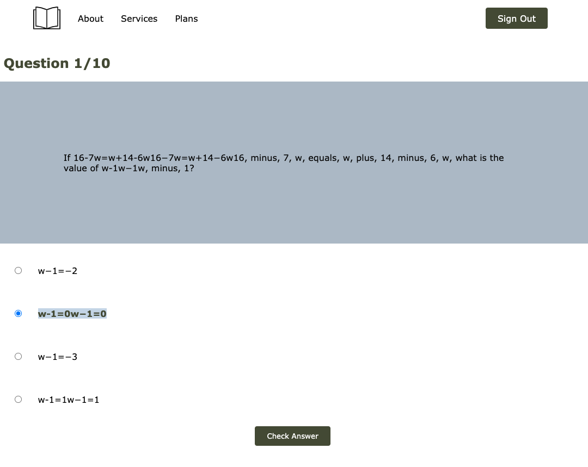

# exameasy
Exameasy is a web app that allows users to take practice exams online for the Licensing Examination by the Hong Kong Securities and Investment Institute.

## Learn More

You can learn more about [HKIS licensing exams](https://www.hksi.org/en/).

## Credit

This project was bootstrapped with [Create React App](https://github.com/facebook/create-react-app).
